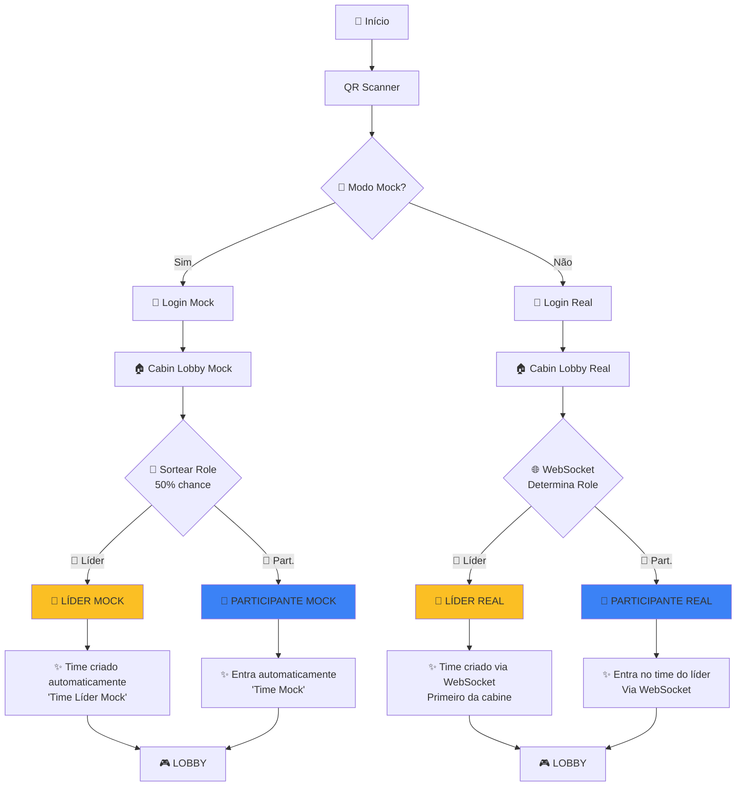

# 👑 Fluxo Líder vs Participante - RodaRico

## 📊 Visão Geral

No sistema de **Sala por Cabine**, existem **dois papéis** distintos:

- **👑 Líder**: Primeiro jogador a escanear o QR Code da cabine
- **👤 Participante**: Jogadores subsequentes que escaneiam o mesmo QR Code

---

## 🔄 Fluxo Completo Lado a Lado

### Modo Mock (Atual - Implementado)



---

## 👑 FLUXO DO LÍDER (Detalhado)

### Passo a Passo

| # | Tela | Líder | O que Acontece |
|---|------|-------|----------------|
| 1 | **QRCodeScanner** | 👑 | Escaneia QR Code da cabine (ou escolhe Mock) |
| 2 | **Login** | 👑 | Faz login com nickname |
| 3 | **CabinLobby** | 👑 | **É o PRIMEIRO** a conectar na cabine → vira LÍDER |
| 4 | **CabinLobby** | 👑 | Time é criado automaticamente (mock) ou via WebSocket (real) |
| 5 | **Lobby** | 👑 | Vê seu time: "Time Líder Mock" (id: 1) |
| 6 | **Lobby** | 👑 | Vê botão **"🚀 Iniciar Desafio"** (só líder tem) |
| 7 | **Lobby** | 👑 | Aguarda participantes (opcional) |
| 8 | **Lobby** | 👑 | **Clica "Iniciar Desafio"** |
| 9 | **Quiz** | 👑 | Responde 5 perguntas |
| 10 | **Result** | 👑 | Vê resultado + botão "Desarmar Bomba" (se sucesso) |
| 11 | **Result** | 👑 | Desarma bomba |
| 12 | **PlayAgain** | 👑 | Escolhe: Jogar Novamente ou Voltar ao Início |

### Características Únicas do Líder

✅ **Pode iniciar o desafio** - Botão "🚀 Iniciar Desafio" visível  
✅ **Cria o time automaticamente** - Não precisa escolher/criar  
✅ **Primeiro da cabine** - Determina quando o jogo começa  
✅ **Badge visual** - Mostra "👑 Líder" na UI  

### Em Modo Mock

```typescript
// CabinLobbyScreen.tsx - Modo Mock para Líder
if (Math.random() > 0.5) {  // 50% chance de ser líder
  setCabinRole('leader');
  setTeam({ id: 1, nome: 'Time Líder Mock' });
  
  // Navega para Lobby
  onRoleAssigned('leader', mockData);
}
```

### Em Modo Real (WebSocket)

```typescript
// CabinLobbyScreen.tsx - Modo Real para Líder
// Cliente envia:
{
  action: 'joinCabinRoom',
  data: { cabineId: 999 }
}

// Servidor responde (primeiro da cabine):
{
  action: 'cabinRoomStatus',
  data: {
    role: 'leader',  // ← É o primeiro!
    cabinStatus: 'empty',
    teamId: undefined,  // Time será criado
    participants: [{ id: 1, nickname: 'Líder', isLeader: true }]
  }
}
```

---

## 👤 FLUXO DO PARTICIPANTE (Detalhado)

### Passo a Passo

| # | Tela | Participante | O que Acontece |
|---|------|--------------|----------------|
| 1 | **QRCodeScanner** | 👤 | Escaneia QR Code da **mesma cabine** que o líder |
| 2 | **Login** | 👤 | Faz login com nickname |
| 3 | **CabinLobby** | 👤 | **Não é o primeiro** → vira PARTICIPANTE |
| 4 | **CabinLobby** | 👤 | Entra automaticamente no time do líder |
| 5 | **Lobby** | 👤 | Vê time do líder: "Time Mock" (id: 1) |
| 6 | **Lobby** | 👤 | **NÃO vê** botão "Iniciar Desafio" |
| 7 | **Lobby** | 👤 | Vê mensagem: "⏳ Aguardando o líder iniciar..." |
| 8 | **Lobby** | 👤 | *(Em mock)* Vê botão debug: "🧪 [Mock Debug] Forçar Início" |
| 9 | **Quiz** | 👤 | Responde 5 perguntas (quando líder iniciar) |
| 10 | **Result** | 👤 | Vê resultado + botão "Desarmar Bomba" (se sucesso) |
| 11 | **Result** | 👤 | Desarma bomba |
| 12 | **PlayAgain** | 👤 | Escolhe: Jogar Novamente ou Voltar ao Início |

### Características Únicas do Participante

❌ **Não pode iniciar** - Botão "Iniciar Desafio" não aparece  
✅ **Entra automaticamente no time** - Não escolhe time  
✅ **Aguarda o líder** - Fica em "waiting" no Lobby  
✅ **Badge visual** - Mostra "👤 Participante" na UI  
✅ **[Mock Debug]** - Em mock, pode forçar início para testes  

### Em Modo Mock

```typescript
// CabinLobbyScreen.tsx - Modo Mock para Participante
else {  // 50% chance de ser participante
  setCabinRole('participant');
  setTeam({ id: 1, nome: 'Time Mock' });  // Entra no time existente
  
  // Navega para Lobby
  onRoleAssigned('participant', mockData);
}
```

### Em Modo Real (WebSocket)

```typescript
// CabinLobbyScreen.tsx - Modo Real para Participante
// Cliente envia:
{
  action: 'joinCabinRoom',
  data: { cabineId: 999 }
}

// Servidor responde (não é o primeiro):
{
  action: 'cabinRoomStatus',
  data: {
    role: 'participant',  // ← Não é o primeiro!
    cabinStatus: 'active',
    teamId: 123,  // ID do time do líder
    teamName: 'Time do Líder',
    leader: 'João',
    participants: [
      { id: 1, nickname: 'João', isLeader: true },
      { id: 2, nickname: 'Maria', isLeader: false }  // ← Você
    ]
  }
}
```

---

## 🎮 Comparação: Lobby Screen

### Líder vê:

```
┌─────────────────────────────────┐
│     Lobby do Time               │
│                                 │
│  Time: Time Líder Mock          │
│                                 │
│  📱 Informações da Cabine       │
│  ID: #999                       │
│  Função: 👑 Líder               │
│  🧪 MODO MOCK ATIVO             │
│                                 │
│  👥 Jogadores (1)               │
│  └─ 👑 Você (Líder)             │
│                                 │
│  ┌───────────────────────────┐  │
│  │ 🚀 Iniciar Desafio        │  │ ← SÓ O LÍDER VÊ
│  └───────────────────────────┘  │
└─────────────────────────────────┘
```

### Participante vê:

```
┌─────────────────────────────────┐
│     Lobby do Time               │
│                                 │
│  Time: Time Mock                │
│                                 │
│  📱 Informações da Cabine       │
│  ID: #999                       │
│  Função: 👤 Participante        │
│  🧪 MODO MOCK ATIVO             │
│                                 │
│  👥 Jogadores (2)               │
│  ├─ 👑 Líder Mock (Líder)       │
│  └─ Você (Mock)                 │
│                                 │
│  ┌───────────────────────────┐  │
│  │ ⏳ Aguardando o líder      │  │
│  │    iniciar o desafio...    │  │
│  └───────────────────────────┘  │
│                                 │
│  ┌───────────────────────────┐  │
│  │ 🧪 [Mock Debug]            │  │ ← SÓ EM MOCK
│  │ Forçar Início do Jogo      │  │
│  └───────────────────────────┘  │
└─────────────────────────────────┘
```

---

## 🔀 Divergências Entre Líder e Participante

| Aspecto | Líder 👑 | Participante 👤 |
|---------|----------|-----------------|
| **Quando é determinado** | Primeiro a conectar na cabine | Segundo+ a conectar na cabine |
| **Time** | Cria automaticamente | Entra no time do líder |
| **Nome do Time (Mock)** | "Time Líder Mock" | "Time Mock" |
| **Botão Iniciar** | ✅ Visível | ❌ Oculto |
| **Pode começar jogo** | ✅ Sim | ❌ Não (aguarda líder) |
| **Badge UI** | "👑 Líder" | "👤 Participante" |
| **Na lista de jogadores** | Marcado como líder | Marcado como participante |
| **Mock Debug Button** | ❌ Não precisa | ✅ Disponível (para testar) |

---

## 📱 Código Relevante

### Determinação de Role (CabinLobbyScreen)

```typescript
// MODO MOCK
const isLeader = Math.random() > 0.5;  // 50% chance

if (isLeader) {
  setCabinRole('leader');
  setTeam({ id: 1, nome: 'Time Líder Mock' });
} else {
  setCabinRole('participant');
  setTeam({ id: 1, nome: 'Time Mock' });
}
```

### UI Condicional (LobbyScreen)

```typescript
{cabinRole === 'leader' ? (
  // Botão para LÍDER
  <Pressable style={styles.startButton} onPress={handleStartGame}>
    <Text>🚀 Iniciar Desafio</Text>
  </Pressable>
) : (
  // Mensagem para PARTICIPANTE
  <>
    <View style={styles.waitingBox}>
      <Text>⏳ Aguardando o líder iniciar o desafio...</Text>
    </View>
    
    {/* Botão de debug apenas em mock */}
    {isMockMode && (
      <Pressable onPress={handleStartGame}>
        <Text>🧪 [Mock Debug] Forçar Início do Jogo</Text>
      </Pressable>
    )}
  </>
)}
```

---

## 🌐 Fluxo Real (Quando Implementado)

### Líder - Fluxo Real

```
QRCodeScanner (escaneia QR real)
    ↓
Login (backend real)
    ↓
CabinLobby
    ↓ WebSocket conecta: ws://backend/ws/cabin
    ↓ Envia: { action: 'joinCabinRoom', data: { cabineId: 999 } }
    ↓ 
    ↓ Servidor verifica: Ninguém conectado ainda na cabine 999
    ↓ Resposta: { role: 'leader', cabinStatus: 'empty' }
    ↓
    ↓ Cliente: setCabinRole('leader')
    ↓ Cliente: Envia { action: 'createTeamForCabin', data: { nome: 'Meu Time' } }
    ↓ Servidor: Cria time e vincula à cabine
    ↓ Resposta: { teamId: 456, teamName: 'Meu Time' }
    ↓
Lobby (como líder)
    ↓ Clica "Iniciar Desafio"
    ↓ Envia: { action: 'startGameForCabin' }
    ↓
Quiz → Result → PlayAgain
```

### Participante - Fluxo Real

```
QRCodeScanner (escaneia MESMO QR)
    ↓
Login (backend real)
    ↓
CabinLobby
    ↓ WebSocket conecta: ws://backend/ws/cabin
    ↓ Envia: { action: 'joinCabinRoom', data: { cabineId: 999 } }
    ↓ 
    ↓ Servidor verifica: Já existe líder na cabine 999
    ↓ Resposta: { role: 'participant', teamId: 456, teamName: 'Meu Time' }
    ↓
    ↓ Cliente: setCabinRole('participant')
    ↓ Cliente: setTeam({ id: 456, nome: 'Meu Time' })
    ↓
Lobby (como participante)
    ↓ Aguarda líder iniciar
    ↓ Recebe broadcast: { action: 'gameStarting' }
    ↓
Quiz → Result → PlayAgain
```

---

## 🧪 Testando os Dois Fluxos em Mock

### Testar como Líder

1. Abra o app
2. QR Scanner → **"🧪 Usar Modo Mock"**
3. Login → Digite "Jogador1"
4. ✅ Se cair como líder:
   - Verá "👑 Líder" na UI
   - Verá "Time Líder Mock"
   - Terá botão "🚀 Iniciar Desafio"
5. Clique para iniciar

### Testar como Participante

1. Recarregue o app (ou use outro dispositivo)
2. QR Scanner → **"🧪 Usar Modo Mock"**
3. Login → Digite "Jogador2"
4. ✅ Se cair como participante:
   - Verá "👤 Participante" na UI
   - Verá "Time Mock"
   - Verá mensagem de espera
   - Terá botão "🧪 [Mock Debug]" para forçar
5. Clique no botão debug para testar

### Forçar um Role Específico (Debug)

Para **sempre ser líder** em mock:

```typescript
// CabinLobbyScreen.tsx - linha ~76
const isLeader = true;  // Forçar líder
// const isLeader = Math.random() > 0.5;
```

Para **sempre ser participante** em mock:

```typescript
// CabinLobbyScreen.tsx - linha ~76
const isLeader = false;  // Forçar participante
// const isLeader = Math.random() > 0.5;
```

---

## 📊 Estatísticas de Uso

| Cenário | Líder | Participantes |
|---------|-------|---------------|
| 1 jogador sozinho | 1 | 0 |
| 2 jogadores (mesmo QR) | 1 | 1 |
| 3 jogadores (mesmo QR) | 1 | 2 |
| 4 jogadores (mesmo QR) | 1 | 3 |
| N jogadores (mesmo QR) | 1 | N-1 |

**Regra:** Sempre há **exatamente 1 líder** por cabine.

---

## 📡 Estímulos Bluetooth no Fluxo

### Comandos Disponíveis

| Comando | Cor | Quando é Enviado | Quem Envia |
|---------|-----|------------------|------------|
| 🟢 **INICIAR** | Verde | Início do jogo | Líder (ou participante em mock debug) |
| 🟠 **ACELERAR** | Laranja | Resposta incorreta | Qualquer jogador que errar |
| 🔴 **EXPLODIR** | Vermelho | Tempo acabou ou todas erradas | Qualquer jogador |
| ⚪ **DESARMAR** | Cinza | Desarmar bomba (sucesso) | Qualquer jogador que desarmar |
| 🔵 **REINICIAR** | Azul | Jogar novamente | Qualquer jogador |

---

## 🎯 Fluxo de Comandos Bluetooth - Detalhado

### 👑 Fluxo do Líder (com comandos Bluetooth)

```
1. QRCodeScanner
   └─ (sem comando Bluetooth)

2. Login
   └─ (sem comando Bluetooth)

3. CabinLobby
   └─ (sem comando Bluetooth)

4. Lobby
   └─ Líder clica "🚀 Iniciar Desafio"
      └─ 🟢 COMANDO: INICIAR
         └─ Arquivo: LobbyScreen.tsx
         └─ await bluetoothService.sendCommand('INICIAR');
         └─ Efeito: ESP32 inicia temporizador da bomba

5. Quiz - Respondendo perguntas
   ├─ ✅ Resposta CORRETA
   │  └─ (sem comando Bluetooth)
   │
   ├─ ❌ Resposta INCORRETA
   │  └─ 🟠 COMANDO: ACELERAR
   │     └─ Arquivo: QuizScreen.tsx
   │     └─ await bluetoothService.sendCommand('ACELERAR');
   │     └─ Efeito: ESP32 acelera o temporizador
   │
   ├─ ⏰ Tempo ACABOU
   │  └─ 🔴 COMANDO: EXPLODIR
   │     └─ Arquivo: QuizScreen.tsx (handleTimeOut)
   │     └─ await bluetoothService.sendCommand('EXPLODIR');
   │     └─ Efeito: ESP32 explode a bomba
   │
   └─ ❌ TODAS INCORRETAS
      └─ 🔴 COMANDO: EXPLODIR
         └─ Arquivo: QuizScreen.tsx
         └─ await bluetoothService.sendCommand('EXPLODIR');
         └─ Efeito: ESP32 explode a bomba

6. Result
   ├─ ✅ SUCESSO (pelo menos 1 correta)
   │  └─ Líder clica "Desarmar Bomba"
   │     └─ ⚪ COMANDO: DESARMAR
   │        └─ Arquivo: ResultScreen.tsx
   │        └─ await bluetoothService.sendCommand('DESARMAR');
   │        └─ Efeito: ESP32 desarma a bomba
   │
   └─ ❌ FALHA
      └─ (sem comando Bluetooth - já explodiu)

7. PlayAgain
   └─ Clica "Jogar Novamente" ou "Voltar ao Início"
      └─ 🔵 COMANDO: REINICIAR
         └─ Arquivo: PlayAgainScreen.tsx
         └─ await bluetoothService.sendCommand('REINICIAR');
         └─ Efeito: ESP32 reseta a bomba para novo jogo
```

### 👤 Fluxo do Participante (com comandos Bluetooth)

```
1. QRCodeScanner
   └─ (sem comando Bluetooth)

2. Login
   └─ (sem comando Bluetooth)

3. CabinLobby
   └─ (sem comando Bluetooth)

4. Lobby
   ├─ 🚫 Participante NÃO pode clicar "Iniciar Desafio"
   │  └─ Aguarda líder iniciar
   │
   └─ 🧪 [Mock Debug] Força início (apenas mock)
      └─ 🟢 COMANDO: INICIAR
         └─ Arquivo: LobbyScreen.tsx
         └─ await bluetoothService.sendCommand('INICIAR');

5-7. Quiz, Result, PlayAgain
   └─ IDÊNTICO ao líder
      └─ Comandos: ACELERAR, EXPLODIR, DESARMAR, REINICIAR
```

---

## 📊 Tabela Comparativa - Comandos Bluetooth

| Momento | Líder 👑 | Participante 👤 | Comando | Origem |
|---------|----------|-----------------|---------|--------|
| **Iniciar Jogo** | ✅ Pode enviar | ❌ Não pode (aguarda) | 🟢 INICIAR | LobbyScreen |
| **Resposta Errada** | ✅ Envia ao errar | ✅ Envia ao errar | 🟠 ACELERAR | QuizScreen |
| **Tempo Acabou** | ✅ Envia | ✅ Envia | 🔴 EXPLODIR | QuizScreen |
| **Todas Erradas** | ✅ Envia | ✅ Envia | 🔴 EXPLODIR | QuizScreen |
| **Desarmar** | ✅ Pode desarmar | ✅ Pode desarmar | ⚪ DESARMAR | ResultScreen |
| **Jogar Novamente** | ✅ Envia | ✅ Envia | 🔵 REINICIAR | PlayAgainScreen |

**⚠️ DIFERENÇA PRINCIPAL:** Apenas o **líder pode enviar INICIAR** (exceto em mock debug).

---

## 🔧 Detalhes Técnicos dos Comandos

### 1. 🟢 INICIAR

**Quando:** Líder clica "🚀 Iniciar Desafio"  
**Arquivo:** `mobile/screens/LobbyScreen.tsx`

```typescript
// LobbyScreen.tsx - linha ~137
await bluetoothService.sendCommand('INICIAR');
```

**O que o ESP32 faz:**
- ✅ Inicia o temporizador da bomba (ex: 10 minutos)
- ✅ LEDs começam a piscar
- ✅ Display mostra contagem regressiva

---

### 2. 🟠 ACELERAR

**Quando:** Qualquer jogador erra uma pergunta  
**Arquivo:** `mobile/screens/QuizScreen.tsx`

```typescript
// QuizScreen.tsx - linha ~163 (mock) e ~272 (real)
if (!isCorrect) {
  await bluetoothService.sendCommand('ACELERAR');
}
```

**O que o ESP32 faz:**
- ✅ Reduz o tempo restante (ex: -30 segundos)
- ✅ LEDs piscam mais rápido
- ✅ Som de alerta (buzzer)

---

### 3. 🔴 EXPLODIR

**Quando:** Tempo acabou OU todas as respostas erradas  
**Arquivo:** `mobile/screens/QuizScreen.tsx`

```typescript
// QuizScreen.tsx - Timeout (linha ~94)
const handleTimeOut = async () => {
  await bluetoothService.sendCommand('EXPLODIR');
  setGameResult('fail');
};

// QuizScreen.tsx - Todas erradas (linha ~191 mock, ~308 real)
if (correctAnswers.length === 0) {
  await bluetoothService.sendCommand('EXPLODIR');
  setGameResult('fail');
}
```

**O que o ESP32 faz:**
- ✅ LEDs ficam todos vermelhos
- ✅ Buzzer faz som de explosão
- ✅ Display mostra "💥 BOOM!"
- ✅ Bomba "explode" (efeitos visuais/sonoros)

---

### 4. ⚪ DESARMAR

**Quando:** Jogador clica "Desarmar Bomba" após sucesso  
**Arquivo:** `mobile/screens/ResultScreen.tsx`

```typescript
// ResultScreen.tsx - linha ~64 (mock) e ~85 (real)
const handleDisarm = async () => {
  await bluetoothService.sendCommand('DESARMAR');
  setGameState('finished');
};
```

**O que o ESP32 faz:**
- ✅ Para o temporizador
- ✅ LEDs ficam verdes
- ✅ Som de sucesso (melodia)
- ✅ Display mostra "✓ DESARMADA!"

---

### 5. 🔵 REINICIAR

**Quando:** Jogador clica "Jogar Novamente"  
**Arquivo:** `mobile/screens/PlayAgainScreen.tsx`

```typescript
// PlayAgainScreen.tsx - linha ~31
const handlePlayAgain = async () => {
  await bluetoothService.sendCommand('REINICIAR');
  resetGameFully();
  // Volta ao QR Scanner
};
```

**O que o ESP32 faz:**
- ✅ Reseta todos os estados
- ✅ LEDs voltam ao estado inicial
- ✅ Display limpa
- ✅ Temporizador reseta
- ✅ Pronto para novo jogo

---

## 🎮 Sequência Típica de Comandos

### Cenário 1: Sucesso (Líder)

```
1. 🟢 INICIAR      → Líder inicia o jogo
2. 🟠 ACELERAR     → Errou 1ª pergunta
3. (sem comando)   → Acertou 2ª pergunta
4. 🟠 ACELERAR     → Errou 3ª pergunta
5. (sem comando)   → Acertou 4ª pergunta
6. (sem comando)   → Acertou 5ª pergunta
7. ⚪ DESARMAR     → Líder desarma com sucesso
8. 🔵 REINICIAR    → Líder quer jogar de novo
```

**Total de comandos:** 5

---

### Cenário 2: Falha por Timeout

```
1. 🟢 INICIAR      → Líder inicia o jogo
2. (sem comando)   → Acertou 1ª pergunta
3. 🟠 ACELERAR     → Errou 2ª pergunta
4. (tempo acabou antes da 3ª pergunta)
5. 🔴 EXPLODIR     → Bomba explode por timeout
6. 🔵 REINICIAR    → Quer jogar de novo
```

**Total de comandos:** 4

---

### Cenário 3: Falha por Todas Erradas

```
1. 🟢 INICIAR      → Líder inicia o jogo
2. 🟠 ACELERAR     → Errou 1ª pergunta
3. 🟠 ACELERAR     → Errou 2ª pergunta
4. 🟠 ACELERAR     → Errou 3ª pergunta
5. 🟠 ACELERAR     → Errou 4ª pergunta
6. 🟠 ACELERAR     → Errou 5ª pergunta (última)
7. 🔴 EXPLODIR     → Todas erradas → bomba explode
8. 🔵 REINICIAR    → Quer jogar de novo
```

**Total de comandos:** 8

---

## 🔍 Como Debugar Comandos Bluetooth

### Ver Logs dos Comandos

Todos os comandos são logados no console:

```typescript
// Console logs típicos:
[Lobby] Mock: Comando INICIAR enviado via Bluetooth
[Quiz] Mock: Comando ACELERAR enviado
[Quiz] Failed to send ACELERAR: Connection lost
[ResultScreen] Mock: Comando DESARMAR enviado via Bluetooth
```

### Modo Mock vs Real

**Em Modo Mock:**
- ✅ Comandos são "simulados" (não vão para hardware)
- ✅ Apenas logs são gerados
- ✅ Útil para testar fluxo sem ESP32

**Em Modo Real:**
- ✅ Comandos são enviados via BLE para ESP32
- ✅ Requer conexão Bluetooth ativa
- ✅ Pode falhar se conexão perder

---

## 📱 Testando Comandos Bluetooth

### Tela de Debug (ControlScreen)

Existe uma tela de debug para testar comandos manualmente:

```
ControlScreen.tsx
├─ Botão "🟢 INICIAR"
├─ Botão "🟠 ACELERAR"
├─ Botão "🔴 EXPLODIR"
├─ Botão "⚪ DESARMAR"
└─ Botão "🔵 REINICIAR"
```

**Como acessar:** (não está no fluxo principal - apenas para dev)

---

## 🔗 Arquivos Relacionados

- **Determinação de Role:** `mobile/screens/CabinLobbyScreen.tsx`
- **UI Líder vs Participante:** `mobile/screens/LobbyScreen.tsx`
- **Comandos Bluetooth:**
  - `mobile/screens/LobbyScreen.tsx` (INICIAR)
  - `mobile/screens/QuizScreen.tsx` (ACELERAR, EXPLODIR)
  - `mobile/screens/ResultScreen.tsx` (DESARMAR)
  - `mobile/screens/PlayAgainScreen.tsx` (REINICIAR)
- **Constantes:** `mobile/constants/bluetooth.ts`
- **Service:** `mobile/services/BluetoothService.ts`
- **Contexto:** `mobile/context/GameContext.tsx`
- **App Navigation:** `mobile/App.tsx`

---

## ❓ FAQ

### P: Posso ter 2 líderes na mesma cabine?
**R:** ❌ Não. Sempre há exatamente **1 líder** por cabine.

### P: E se o líder sair?
**R:** Em modo real (futuro), o backend deve promover um participante a líder. Em mock, o jogo acaba.

### P: Participante pode iniciar o jogo?
**R:** ❌ Não em modo real. ✅ Sim em modo mock (botão debug).

### P: Como mudar de participante para líder?
**R:** ❌ Não é possível. O role é determinado ao escanear o QR Code.

### P: Líder pode jogar sozinho?
**R:** ✅ Sim! Não é obrigatório ter participantes.

---

*Documentação criada em: Janeiro 2026*  
*Fluxo implementado: Modo Mock*  
*Fluxo planejado: Modo Real (WebSocket backend)*

