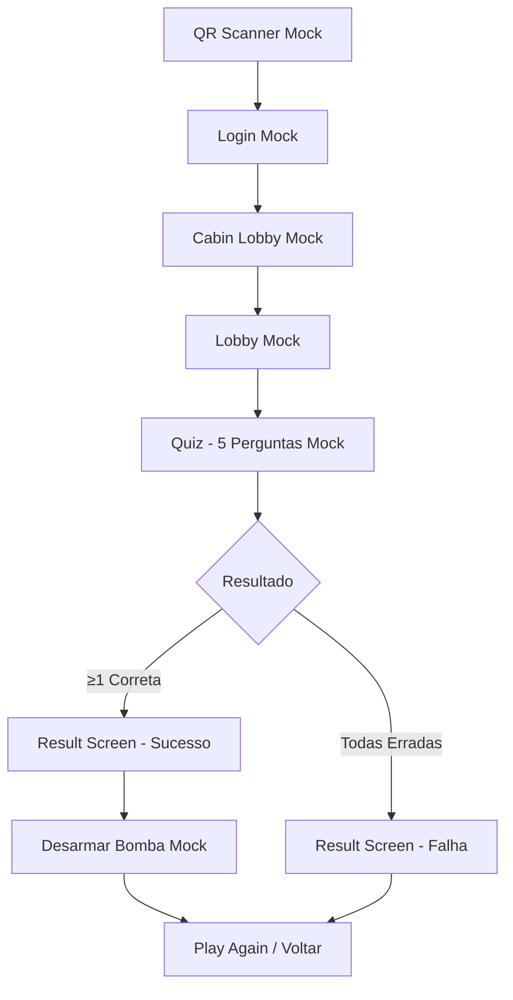

# 🎯 Perguntas Mock - RodaRico

## Visão Geral

Este documento descreve o sistema de perguntas mock implementado no **QuestionService** para permitir testes completos do fluxo de jogo sem necessidade de conexão com o backend.

---

## 📋 Lista de Perguntas Mock

O sistema inclui **8 perguntas mock** relacionadas ao cenário de desarme de bomba:

### Pergunta 1
- **ID:** 1
- **Texto:** "Qual é a cor do fio que deve ser cortado primeiro em um circuito padrão?"
- **Pontos:** 100
- **Categoria:** Identificação visual

### Pergunta 2
- **ID:** 2
- **Texto:** "Quantos segundos restam no temporizador quando o LED verde acende?"
- **Pontos:** 150
- **Categoria:** Leitura de tempo

### Pergunta 3
- **ID:** 3
- **Texto:** "Qual é o código de 4 dígitos exibido no display da bomba?"
- **Pontos:** 200
- **Categoria:** Memorização

### Pergunta 4
- **ID:** 4
- **Texto:** "Em qual sequência os LEDs piscam: vermelho, azul ou verde primeiro?"
- **Pontos:** 100
- **Categoria:** Sequência visual

### Pergunta 5
- **ID:** 5
- **Texto:** "Quantos fios existem conectados ao módulo principal?"
- **Pontos:** 150
- **Categoria:** Contagem

### Pergunta 6
- **ID:** 6
- **Texto:** "Qual é o símbolo impresso na carcaça da bomba?"
- **Pontos:** 100
- **Categoria:** Identificação visual

### Pergunta 7
- **ID:** 7
- **Texto:** "Qual botão deve ser pressionado: A, B ou C?"
- **Pontos:** 200
- **Categoria:** Escolha múltipla

### Pergunta 8
- **ID:** 8
- **Texto:** "Qual é a frequência em Hz mostrada no medidor?"
- **Pontos:** 150
- **Categoria:** Leitura técnica

---

## 🔧 Como Funciona o Modo Mock

### Ativação Automática

O modo mock é ativado automaticamente quando:
- O usuário escolhe "Usar Modo Mock" na tela de Scanner QR
- `isMockMode = true` no `GameContext`
- Todas as telas (Login, CabinLobby, Lobby, Quiz) detectam automaticamente
- **WebSocket não é usado** em modo mock
- **API HTTP não é chamada** em modo mock

### Comportamento do Mock

#### 1. **Seleção de Perguntas** (`getRandomQuestions`)
```typescript
QuestionService.enableMockMode();
const questions = await QuestionService.getRandomQuestions(5);
```

**Comportamento:**
- Embaralha as 8 perguntas disponíveis
- Retorna N perguntas aleatórias (padrão: 5)
- Sem chamadas de rede
- Resposta instantânea

#### 2. **Resposta de Perguntas** (`answerQuestion`)
```typescript
const result = await QuestionService.answerQuestion(
  perguntaId,
  pergunta,
  resposta,
  pontos
);
```

**Comportamento:**
- Simula delay de rede de 300ms
- **70% de chance de resposta correta**
- **30% de chance de resposta incorreta**
- Retorna pontos apenas se correto

**Estrutura de Resposta:**
```typescript
{
  correct: boolean,    // true ou false (70% true)
  pontos: number       // pontos se correto, 0 se incorreto
}
```

---

## 💻 Uso no Código

### Ativar Modo Mock
```typescript
import { QuestionService } from '../services/QuestionService';

QuestionService.enableMockMode();
```

### Desativar Modo Mock
```typescript
QuestionService.disableMockMode();
```

### Exemplo Completo
```typescript
import { QuestionService } from '../services/QuestionService';

// Modo Mock
QuestionService.enableMockMode();

// Buscar 5 perguntas mock
const questions = await QuestionService.getRandomQuestions(5);
console.log('Perguntas:', questions);
// Output: Array de 5 perguntas aleatórias

// Responder uma pergunta
const answer = await QuestionService.answerQuestion(
  1,
  "Qual é a cor do fio?",
  "Vermelho",
  100
);
console.log('Resultado:', answer);
// Output: { correct: true, pontos: 100 } ou { correct: false, pontos: 0 }
```

---

## 🎮 Fluxo de Jogo Mock

### 1. Scanner QR → Mock
```
QRCodeScannerScreen
  ↓ Usuário clica "Usar Modo Mock"
  ↓ setIsMockMode(true)
LoginScreen (login mock)
  ↓
CabinLobbyScreen (conexão mock)
  ↓
LobbyScreen
```

### 2. Iniciar Jogo
```typescript
// Em LobbyScreen.tsx
if (isMockMode) {
  QuestionService.enableMockMode();
  const questions = await QuestionService.getRandomQuestions(5);
  // 5 perguntas mock retornadas instantaneamente
}
```

### 3. Responder Perguntas
```typescript
// Em QuizScreen.tsx (com modo mock detectado automaticamente)
if (isMockMode) {
  // Processar localmente via QuestionService mock
  const result = await QuestionService.answerQuestion(
    question.id,
    question.pergunta,
    userAnswer,
    question.pontos
  );

  if (result.correct) {
    // 70% de chance
    console.log('Correto! +' + result.pontos);
    // Enviar ACELERAR não é necessário
  } else {
    // 30% de chance
    console.log('Incorreto!');
    // Enviar ACELERAR via Bluetooth mock
    await bluetoothService.sendCommand('ACELERAR');
  }
} else {
  // Modo real: enviar via WebSocket
  wsService.send({
    action: 'answerPerguntas',
    data: { perguntaId, answer, partidaId }
  });
}
```

**O que acontece em modo mock:**
1. ✅ Resposta é processada **instantaneamente** (sem WebSocket)
2. ✅ Resultado simulado retorna em ~300ms
3. ✅ 70% de chance de acerto
4. ✅ Pontos são atualizados localmente
5. ✅ Comando Bluetooth mock é enviado se errar
6. ✅ Próxima pergunta é exibida automaticamente

---

## 📊 Estatísticas do Mock

| Métrica | Valor |
|---------|-------|
| Total de Perguntas | 8 |
| Perguntas por Jogo | 5 (padrão) |
| Taxa de Acerto Simulada | 70% |
| Delay de Resposta | 300ms |
| Pontos Mínimos | 100 |
| Pontos Máximos | 200 |
| Pontos Médios por Jogo | 525 (média) |

**Cálculo de Pontos Médios:**
```
Perguntas: 5
Pontos médios por pergunta: 150
Taxa de acerto: 70%
Total: 5 × 150 × 0.7 = 525 pontos
```

---

## 🧪 Testando

### Teste Manual
1. Abra o app
2. Na tela de Scanner QR, clique "Usar Modo Mock"
3. Faça login com qualquer nickname
4. Na tela de Lobby, clique "🧪 [Mock Debug] Forçar Início do Jogo"
5. Responda as 5 perguntas que aparecem
6. Observe que ~70% das respostas serão marcadas como corretas

### Logs de Debug
```typescript
// Console output esperado:
[QuestionService] Modo mock ATIVADO
[QuestionService] Modo Mock - Retornando perguntas mock
[QuestionService] Mock: 5 perguntas selecionadas
[QuestionService] Modo Mock - Simulando resposta
[QuestionService] Mock: Resposta simulada: { correct: true, pontos: 150 }
```

---

## 🔄 Adicionando Novas Perguntas Mock

Para adicionar novas perguntas ao sistema mock:

1. Abra `mobile/services/QuestionService.ts`
2. Adicione à lista `MOCK_QUESTIONS`:

```typescript
const MOCK_QUESTIONS: Question[] = [
  // ... perguntas existentes ...
  {
    id: 9,
    pergunta: "Sua nova pergunta aqui?",
    pontos: 100,
  },
];
```

3. Atualize esta documentação com a nova pergunta

---

## 🎯 Casos de Uso

### Desenvolvimento
- Testar fluxo de jogo sem backend
- Debug de lógica de pontuação
- Validar UI de perguntas e respostas

### Demos
- Apresentações para clientes
- Testes de UX
- Validação de conceito

### CI/CD
- Testes automatizados
- Validação de builds
- Smoke tests

---

## 📝 Notas Importantes

1. **Modo Mock é Local**: Nenhuma pergunta ou resposta é enviada ao servidor
2. **Resultados Aleatórios**: A taxa de 70% garante uma experiência realista
3. **Perguntas Embaralhadas**: Cada jogo terá uma ordem diferente
4. **Pontuação Simulada**: Os pontos são calculados localmente

---

## 🎮 Integração com Telas de Jogo

### QuizScreen (Perguntas e Respostas)

O `QuizScreen` detecta automaticamente o modo mock e processa as respostas localmente:

### Fluxo Mock no QuizScreen

```typescript
// QuizScreen.tsx - handleSubmitAnswer()

if (isMockMode) {
  // 1. Processar resposta localmente
  const result = await QuestionService.answerQuestion(...);
  
  // 2. Atualizar pontuação
  setScore(prev => prev + result.pontos);
  
  // 3. Adicionar à lista de respostas
  addAnswer({ perguntaId, respostaUsuario, isCorrect: result.correct });
  
  // 4. Enviar comando Bluetooth se errou
  if (!result.correct) {
    await bluetoothService.sendCommand('ACELERAR');
  }
  
  // 5. Próxima pergunta ou finalizar
  if (hasMoreQuestions) {
    setCurrentQuestionIndex(index + 1);
  } else {
    checkGameResult(); // Sucesso se pelo menos 1 correta
  }
} else {
  // Modo real: enviar via WebSocket e aguardar resposta
}
```

### Critérios de Vitória/Derrota

**Em modo mock (e modo real):**
- ✅ **Sucesso**: Pelo menos 1 resposta correta entre todas
- ❌ **Falha**: Todas as respostas incorretas
- ❌ **Falha**: Tempo esgotado (timeout)

**Comandos Bluetooth enviados em QuizScreen:**
- `INICIAR`: Ao começar o jogo
- `ACELERAR`: Cada resposta incorreta
- `EXPLODIR`: Todas incorretas ou timeout

---

### ResultScreen (Desarmar Bomba)

O `ResultScreen` também suporta modo mock para desarmar a bomba:

```typescript
// ResultScreen.tsx - handleDisarm()

if (isMockMode) {
  // 1. Enviar comando Bluetooth mock
  await bluetoothService.sendCommand('DESARMAR');
  
  // 2. Simular delay de processamento (1 segundo)
  await new Promise(resolve => setTimeout(resolve, 1000));
  
  // 3. Finalizar partida localmente
  setGameState('finished');
  
  // 4. Navegar para tela de "Jogar Novamente"
  onPlayAgain();
} else {
  // Modo real: enviar via WebSocket e aguardar resposta
  wsService.send({ action: 'finalizarPartida', data: { id, result } });
}
```

**Comportamento em modo mock:**
- ✅ Comando `DESARMAR` enviado via Bluetooth mock
- ✅ Delay de 1 segundo simula processamento
- ✅ Partida finalizada localmente (sem WebSocket)
- ✅ Navegação automática para próxima tela
- ✅ **Botões "Jogar Novamente" e "Voltar ao Lobby" não resetam WebSocket**

---

## 🔗 Arquivos Relacionados

- **Implementação:** `mobile/services/QuestionService.ts`
- **Uso - Inicialização:** `mobile/screens/LobbyScreen.tsx`
- **Uso - Respostas:** `mobile/screens/QuizScreen.tsx`
- **Uso - Desarme:** `mobile/screens/ResultScreen.tsx`
- **Tipos:** `mobile/services/QuestionService.ts` (interfaces)
- **Contexto:** `mobile/context/GameContext.tsx`

---

## 🐛 Troubleshooting

### "Failed to fetch questions"
**Solução:** Verifique se `QuestionService.enableMockMode()` foi chamado antes de `getRandomQuestions()`

### Respostas sempre incorretas em mock
**Problema:** Taxa de 70% significa que ~30% das respostas serão incorretas aleatoriamente
**Solução:** Isso é comportamento esperado para simular um jogo real

### WebSocket errors em modo mock
**Problema:** Código ainda está tentando conectar ao WebSocket
**Solução:** Verifique se `isMockMode = true` no `GameContext` está propagando corretamente

### Pontos não atualizam
**Problema:** `setScore` não está sendo chamado
**Solução:** Verifique logs do console: `[Quiz] Mock: Resultado da resposta`

---

## 🚀 Status Completo do Modo Mock

| Tela/Serviço | Modo Mock | Arquivo | Funcionalidade |
|--------------|-----------|---------|----------------|
| QR Scanner | ✅ | `QRCodeScannerScreen.tsx` | Gera QR mock sem escanear |
| Login | ✅ | `LoginScreen.tsx` | Login offline com tokens mock |
| Cabin Lobby | ✅ | `CabinLobbyScreen.tsx` | Atribui role sem WebSocket |
| Lobby | ✅ | `LobbyScreen.tsx` | Carrega perguntas mock |
| Quiz (Perguntas) | ✅ | `QuizScreen.tsx` | 5 perguntas aleatórias mock |
| Quiz (Respostas) | ✅ | `QuizScreen.tsx` | Valida respostas localmente |
| **Result (Desarmar)** | ✅ | `ResultScreen.tsx` | **Desarma bomba sem API** |
| Bluetooth | ✅ | `BluetoothService.ts` | Simula comandos BLE |
| WebSocket | ❌ | - | **Não usado em mock** |
| HTTP API | ❌ | - | **Não usado em mock** |

### 🎮 Fluxo Completo End-to-End (Mock)



**✅ 100% Offline**
**✅ 0 Chamadas de Rede**
**✅ Testável em Qualquer Ambiente**

---

*Última atualização: Janeiro 2026*

